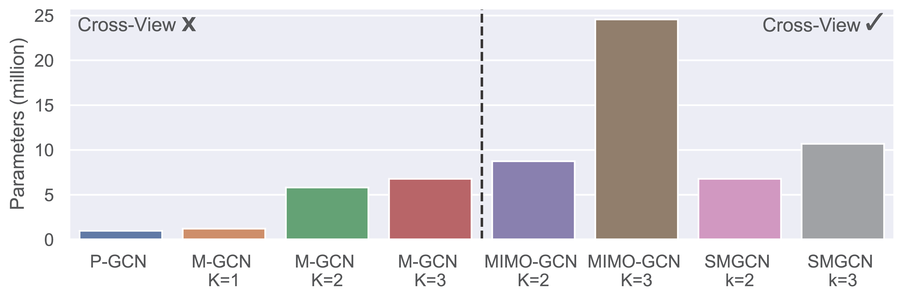

# Simple Multigraph Convolution Networks (SMGCN)
Pytorch implementation of the paper [WWW'2024] ["Simple Multigraph Convolution Networks"](https://arxiv.org/abs/2403.05014)


## TL;DR
Previous methods for multigraph rather **lacks cross-view** interaction or are **too inefficient** to be used in practice. We propose a simple and efficient multigraph convolutional networks based on both edge-level and subgraph-level credible graph extraction from multigraph. We show that our method outperforms previous methods on several multigraph datasets and is more parameter efficient and theoretically sound.


## Usage
### Data preparation
We use the standard torch_geometric object to represent the multigraph. Run the `data.py` to download and preprocess the datasets. 
```bash
cd src/DBLP
python data.py
```
Take SMGCN (k=2) as an example, simply run the following command to train the model.
```bash
python train.py SMGCN2.py
```

## Parameters Comparison

